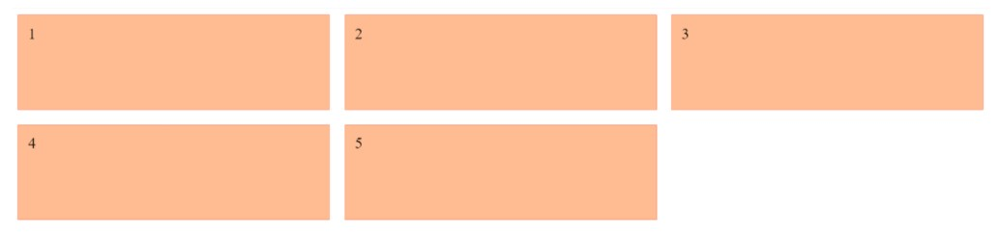
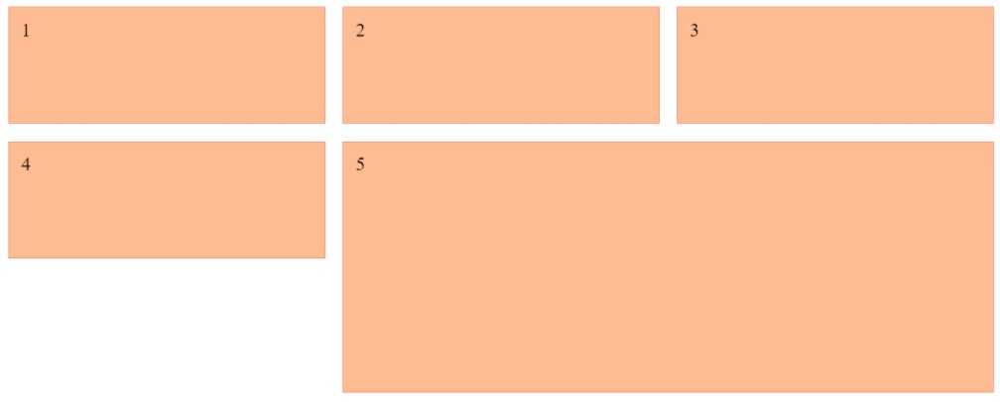

# Grid

Le module `CSS Grid Layout` (modèle de disposition en grille) est un module de la spécification CSS qui permet de créer des mises en page en divisant l'espace d'affichage en régions utilisables par une application ou en définissant des relations de taille, position et d'empilement entre les éléments HTML.

- [A Complete Guide to CSS Grid](https://css-tricks.com/snippets/css/complete-guide-grid/)
- [CSS Grid Functions](https://developer.mozilla.org/en-US/docs/Web/CSS/CSS_Functions#css_grid_functions)

## Code

`Ex1`

```html

<div id="grille">
  <div class="element">1</div>
  <div class="element">2</div>
  <div class="element">3</div>
  <div class="element">4</div>
  <div class="element">5</div>
</div>

```

```css

#grille {
  display: grid;
  grid-template-columns: repeat(3, 1fr);
  grid-auto-rows: 150px;
  gap: 15px;
}

.element {
  border: 1px solid #ff8e6e;
  background: #ffbb91;
  padding: 10px;
}

```

<p align="center">
  
</p>

`Ex2`

```html

<div id="grille">
  <div class="element">1</div>
  <div class="element">2</div>
  <div class="element">3</div>
  <div class="element">4</div>
  <div class="element">5</div>
</div>

```

```css

#grille {
  display: grid;
  grid-template-columns: repeat(3, 1fr);
  grid-gap: 15px;
  grid-auto-rows: 100px;
}

.element {
  border: 1px solid #ff8e6e;
  background: #ffbb91;
  padding: 10px;
}

.element:nth-of-type(5) {
  grid-column-start: 2;
  grid-column-end: 4;
  grid-row-start: 2;
  grid-row-end: 4;
}

```

<p align="center">
  
</p>

## Poster

<p align="center">
  
</p>
