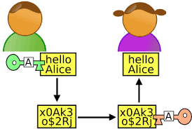

# Git (Versionning & Collaboration)

<p align="center">
  
</p>

[Git](https://git-scm.com/) est un outil collaboratif de [gestion de version](https://fr.wikipedia.org/wiki/Gestion_de_versions), créé par Linus Torvalds. C'est un outil simple et performant, dont la principale tâche est de gérer l'évolution du contenu d'une arborescence (donc d'un site internet).

## Concepts fondamentaux de git

Pour un dossier de travail donné, Git manipule différents **espaces virtuels**:

| Espaces             | Description                           |
| :------------------ | :------------------------------------ | 
| `Workspace`         | espace stockant les modifications en cours, qui ne sont pas (encore) prises en compte par Git. |
| `Index (ou Stage)`  | espace stockant les modifications en cours, qui seront prises en compte par Git pour le prochain commit (mais pas encore commitées). |
| `Local Repository`  | espace stockant les modifications déjà prises en compte par Git. |
| `Remote Repository` | désigne le dépôt distant (remote, sur [GitHub](https://github.com/) par exemple), dépôt auquel est relié votre dépôt local. **Les commits du local repository doivent y être pushés pour mettre le dépôt distant à jour** et collaborer avec d'autres personnes. |

<br>

<p align="center">
  
</p>

## Créer une clé SSH pour GitHub

Avant toute chose, pour utiliser [Git](https://git-scm.com/) et [GitHub](https://github.com/) à leur pleins potentiels, on va créer une clé dite SSH. Cette clé est une carte d'identité nous permettant de nous authentifier auprès de [GitHub](https://github.com/), notamment pour accéder aux repos privés, signer nos commits, etc.

- [Connecting to GitHub with SSH](https://help.github.com/articles/connecting-to-github-with-ssh/) 

### Vérification de clés existantes

Avant de générer une clé SSH, on peut vérifier si nous n'avons pas déjà de clés existantes.

```sh

# Affiche les fichiers du répertoire .ssh, si ils existent
$ ls -al ~/.ssh

```

Par défaut, les noms de fichier des clès publiques supportées pour GitHub sont les suivantes: 
- `id_rsa.pub`
- `id_ecdsa.pub`
- `id_ed25519.pub`

### Création de la clé

```sh

# Attention à bien remplacer l'email par le votre ;)
$ ssh-keygen -t ed25519 -C "your_email@exemple.fr"

```

⚠️ **WARNING**

> Si votre système ne supporte pas Algorithme Ed25519, il faudra utiliser ce code:

```sh

# Attention à bien remplacer l'email par le votre ;)
$ ssh-keygen -t rsa -b 4096 -C "votre-email@exemple.fr"

```

> Il vous sera demandé d'inventer **une passphrase**, c'est-à-dire un mot de passe un peu costaud (qui peut carrément être une phrase, avec des espaces, des accents et tout ! Cette passphrase n'est pas strictement obligatoire (elle peut être vide…), mais il est fortement recommandé d'en choisir une. Par contre, il faut la retenir par cœur, si elle est perdue, **la clé SSH est bonne à jeter !**

Une clé SSH se compose de **deux parties**, si bien qu'à l'issue de la commande, vous obtenez deux choses:

- une **clé privée** dans `/home/mint/.ssh/id_rsa` — pour protégér du contenu, à garder pour soi !
- une **clé publique** dans `/home/mint/.ssh/id_rsa.pub` — elle est capable de lire du contenu protégé par la clé privé

<p align="center">
  
</p>

### Ajout de la clé publique sur GitHub

Vous allez donc copier le contenu de la clé publique sur [GitHub](https://github.com/). Vous pouvez regarder le contenu de la clé publique, par curiosité:

```sh

# Pour récupérer le contenu de notre clé publique
cat ~/.ssh/id_rsa.pub

```

Copiez ce contenu, et allez le coller dans votre compte [GitHub](https://github.com/):

```sh

Settings > SSH and GPG keys > New SSH key > Coller le contenu de la clé et valider

```

⚠️ **WARNING**

> Pour que Git utilise automatiquement **la clé SSH** pour authentifier les commandes git ..., il faut utiliser des URLs avec le protocole `SSH` plutôt que `HTTPS`. [Why is GIT always asking for my password?](https://help.github.com/articles/why-is-git-always-asking-for-my-password/)

### Activation de la clé SSH en local

Pour que la clé SSH soit utilisable, et aussi pour éviter d'avoir à donner sa passphrase à chaque utilisation, il faut ajouter la clé privée à un « trousseau de clé » (programme `ssh-agent`):

```sh

eval "$(ssh-agent -s)" # pour lancer ssh-agent de façon sécurisée
ssh-add ~/.ssh/id_rsa # pour activer la clé SSH

```

⚠️ **WARNING**

> Si vous oubliez cette étape, vous aurez des erreurs du type "Permission denied (publickey)" lors de l'utilisation de Git & GitHub.

## Configuration locale de git

Git peut être configuré [très précisement](https://git-scm.com/docs/git-config). Voici quelques réglages utiles à mettre en place:

**Nom affiché dans les commits:**

```sh

# N'oubliez pas de changer le nom par le votre… ;)
git config --global user.name "John Wick"

```

**Email associé au commit (conseil : le même que celui du compte GitHub):**

```sh

# N'oubliez pas de changer l'email par le votre… ;)
git config --global user.email "john.wick@lecroquemitaine.fr"

```

**Choix de l'éditeur de texte utilisé pour écrire les messages de commit:**

```sh

git config --global core.editor nano # ou code pour Visual Studio Code, etc.

```

**Activation des couleurs dans le résultat des commandes Git:**

```sh

git config --global color.ui true

```

⚠️ **WARNING**

> Pour vérifier la configutation complète: `git config -l`. Cette commande va afficher tous les réglages actifs de `git`.

## Commandes git

- [Cheat Sheet Git](assets/Github_Git_Cheat_Sheet.pdf)
- [GitFlow, méthode de travail très efficace pour gérer les branches](https://www.atlassian.com/fr/git/tutorials/comparing-workflows/gitflow-workflow)

### Obtenir la version de git

| Nom                 | Description                                |
| :-------------------| :----------------------------------------- |
| `git --version`     | renvoie la version installée de git        |

### Obtenir de l'aide

| Nom                 | Description                                |
| :-------------------| :----------------------------------------- |
| `git --help`        | renvoie la liste des commandes disponibles |
| `git [commande] -h` | idem pour une commande précise             |

### Cloner ou initier un repo

| Nom                           | Description                                |
| :---------------------------- | :----------------------------------------- |
| `git clone [url] [nom-local]` | récupère un repo distant (remote sur GitHub par exemple) en local, dans un dossier créé à la volée qu'il est possible de renommer (par défaut : nom du repo sur le remote) |
| `git init`                    | crée un nouveau projet Git local à partir d'un dossier courant. Si on veut ensuite le partager sur GitHub, il faudra alors paramétrer au moins un remote            |


### Pour les premiers commits

<p align="center">
  
</p>

### Vérifier l'état courant du repo local

| Nom          | Description                                                                       |
| :----------- | :-------------------------------------------------------------------------------- |
| `git status` | récapitule l'état local (workspace et index) des fichiers du projet géré avec Git |


- **En rouge:** modifié mais non pris en compte (= en workspace)
- **En vert:** modifié et pris en compte (= ajouté à l'index)

### En Cas de suppression de votre fichier .git (Cloné depuis GitHub)

```sh

git init
git remote add origin ssh@le/lien/vers/ton/repo.git
git add .
git commit -m "on envoiiiie"
git push origin --force master

```

### En cas de dépôt local corrompu

Si vous avez des messages du type:

```sh

error: object file .git/objects/31/65329bb680e30595f242b7c4d8406ca63eeab0 is empty.

```

```sh

fatal: loose object 3165329bb680e30595f242b7c4d8406ca63eeab0 (stored in .git/objects/31/65329bb680e30595f242b7c4d8406ca63eeab0) is corrupt.

```

C'est que votre dépôt local est corrompu. Voici la manoeuvre pour réparer:

```sh

find .git/objects/ -type f -empty | xargs rm
git fetch -p
git fsck --full

```

### En cas de bétises

Il suffit juste de connaître les bonnes commandes 😉.

Voici donc 2 ressources qui expliquent bien ces commandes, et dans quel cas les utiliser.

- [Ohshitgit](https://ohshitgit.com/fr)
- [Dangitgit](https://dangitgit.com/fr)

## Fichiers spéciaux

| Nom       | Description                                                           |
| :-------- | :-------------------------------------------------------------------- |
| `.gitignore` | permet de lister des fichiers qui doivent être ignorés lors du add |
| `.gitkeep`   | est un fichier qui peut être placé à la racine d'un répertoire vide afin que git prenne ce dossier en compte même s'il ne contient pas de fichier |

# GitHub (Code Hosting Platform)

<p align="center">
  
</p>

Pour faciliter la communication autour du projet, les bons vieux emails fonctionnent, mais il existe aujourd'hui des sites et de services complémentaires à Git. Le site [GitHub](https://github.com/) est l'un d'entre eux.

C'est une plateforme de services & un réseau social — Il agit comme un serveur central, permettant de partager son code dans un dépôt [Git](https://git-scm.com/) centralisé et partagé sur internet, mais également de communiquer avec d'autres développeurs par l'intermédiaire de commentaires, d'issues, etc.

[GitHub](https://github.com/) est probablement le réseau social de développeurs le plus populaire aujourd'hui.

<p align="center">
  
</p>

Mais, il n'est pas le seul. Il existe également d'autres services comme:

- [GitLab](https://docs.gitlab.com/ee/user/project/repository/)
- [Bitbucket](https://bitbucket.org/)
