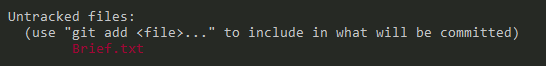
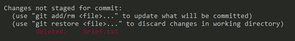
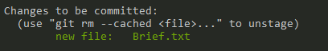
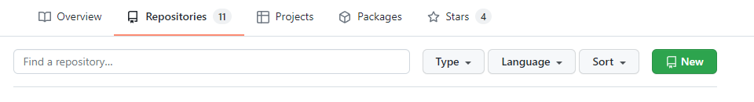
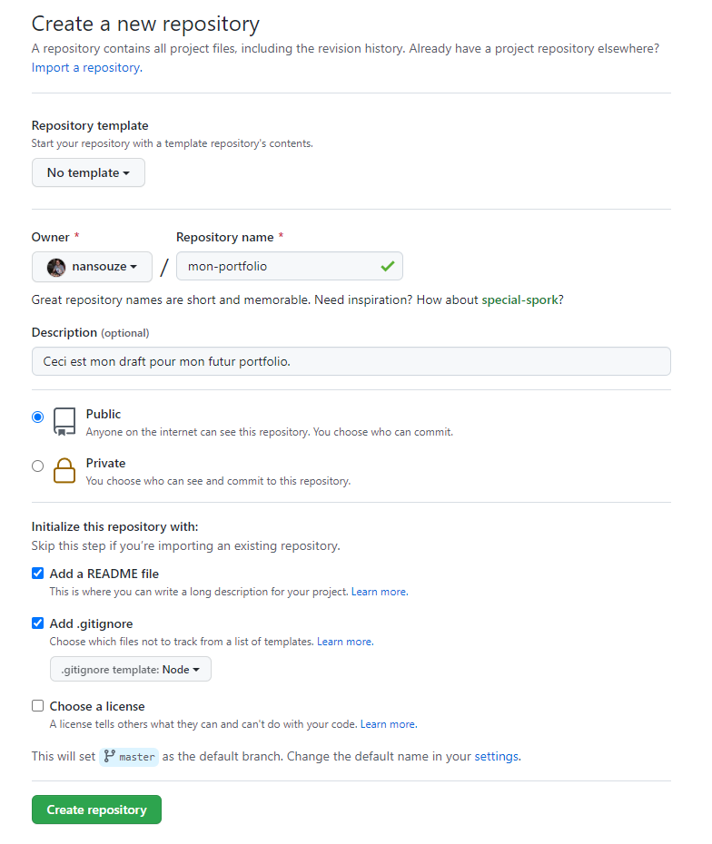

# Commandes Git

- [Cheat Sheet Git](assets/pdf/Github_Git_Cheat_Sheet.pdf)
- [GitFlow, méthode de travail très efficace pour gérer les branches](https://www.atlassian.com/fr/git/tutorials/comparing-workflows/gitflow-workflow)
- [Découvrir Git](https://www.atlassian.com/fr/git/tutorials/learn-git-with-bitbucket-cloud)
- [Apprendre Git par la pratique](https://learngitbranching.js.org/)
- [Git Explorer](https://gitexplorer.com/)

## Général

### `git --version` - Obtenir la version de git

```sh

# Renvoie la version installée de git
git --version
git version 2.35.1

```

### `git --help` - Obtenir de l'aide

```sh

# Renvoie la liste des commandes disponibles
git --help

# Idem pour une commande précise 
git [commande] -h

```

### `git config` - Configuration des outils

Cela va permettre de configurer les informations de l'utilisateur pour tous les dépôts locaux.

```sh

# Nom affiché dans les commits
git config --global user.name "John Wick"

```

```sh

# Email associé au commit (conseil: le même que celui du compte GitHub):
git config --global user.email "john.wick@lecroquemitaine.fr"

```

```sh

# Choix de l'éditeur de texte utilisé pour écrire les messages de commit:
git config --global core.editor nano # ou code pour Visual Studio Code, ou vim pour VIM etc.

```

```sh

# Utilisation de 'master' comme nom de la branche initiale.
# Pour configurer le nom de la branche initiale pour tous les nouveaux dépôts.
# 'master' -> 'main', 'trunk' & 'development'.
git config --global init.defaultBranch <nom>

# La branche nouvellement créée peut être rénommée avec:
git branch -m <nom>

```

```sh

# Activation des couleurs dans le résultat des commandes git
git config --global color.ui true

```

⚠️ **WARNING**

> Pour vérifier la configutation complète: `git config -l`. Cette commande va afficher tous les réglages actifs de `git`.

## Dépôt Local

### `git init` - Initialiser où Créer un dépôt
```sh

# Initialiser un dépot local
git init

# Créer un dépôt local à partir du nom spécifié
git init [nom-du-projet]

# Message généré après l'initialisation (dossier caché .git)
Initialized empty Git repository in C:/Users/fsb/Desktop/Projet/.git/

```

### `git status` - Vérifier l'état courant du dépot

```sh

# Récapitule l'état local (workspace et index) des fichiers du projet géré avec git
git status

```

**En rouge:**

<p align="center">
  
</p>

<p align="center">
  
</p>

**En vert:**

<p align="center">
  
</p>

### `git add` - Ajouter un fichier

```sh

# Modifications qui vont être comittées
git add [files]

# Différentes façon ajouter un fichier
git add Brief.txt
git add .
git add -A

# Pour unstage un fichier
git rm --cached Brief.txt

```

### `git commit -m` - Valider les modifications

```sh

# Modifications qui vont être comittées
git commit -m "Ceci est mon 1er commit"

```

### `git log` - Historique des modifications

```sh

# Afficher tous les commits
git log

```

## Dépôt Distant (GitHub)

### Créer son 1er dépôt via l'interface de GitHub

<p align="center">
  
</p>

<p align="center">
  
</p>

### Créer son 1er dépôt via le terminal

```sh

echo "# mon-projet" >> README.md
git init
git add README.md
git commit -m "first commit"
git branch -M master
git remote add origin https://github.com/nansouze/mon-projet.git
git push -u origin master

```

### Associer un dépôt local à un dépôt distant

```sh

git remote add origin https://github.com/nansouze/mon-projet.git
git branch -M master
git push -u origin master

```

### Récupérer un dépôt distant

```sh

# Télécharge un projet et tout son historique de versions (par défaut : nom du repo sur le remote)
git clone [url] [nom-du-projet]

```

### Changer git remote origin

```sh

git remote set-url origin [url]

```

### Envoyer & recevoir les mises à jour

```sh

# Envoyer
git push

# Recevoir
git pull

```

## Branches

### Afficher les branches existantes

```sh

git branch

```

### Créer une branche

```sh

git branch [nom-de-la-branche]

```

### Changer de branche

```sh

git checkout [nom-de-la-branche]

```

### Publier sur une nouvelle branche sur GitHub

```sh

git push -u origin [nom-de-la-branche]

```

### Fusionner plusieurs branches

```sh

# Deux types de fusion:
# Fusion Fast Forward (avance rapide) -> si master n'a pas changé. c'est le meilleur des cas 😄
# Fusion à 3 sources (commit à partir de laquelle on a crée notre nouvelle branche / dernier commit master / dernier commit de notre branche)

git merge [nom-de-la-branche]

```

⚠️ **WARNING**
> Il faut bien se positionner sur la bonne branche pour la fusion. Par exemple, si je suis sur `master` et que j'ai une 2e branche `avis`, c'est cette dernière qui sera fusionner sur `master`.

### Supprimer une branche après fusion en local

```sh

git branch -d [nom-de-la-branche]

```

### Supprimer une branche après fusion sur GitHub

```sh

git push -u origin --delete [nom-de-la-branche]

```

## TIPS

### Modifier son dernier commit

```sh

# Modification du dernier commit
git commit --amend

```

### Undo du dernier commit (n'annule pas le dernier commit mais en crée un nouveau)

```sh

git revert HEAD

```

### Liste des branches

```sh

# Fusionnées
git branch --merged

# Non Fusionnées
git branch --no-merged

```

### Modifier ses branches avec git rebase

```sh

# Avant de publier sur GitHub
# Permet de garder un historique clair (éviter les commits de fusion)
# Fusion à la base à 3 sources -> Elle se transforme en Fast Forward 

# à la place de git merge master [nom-de-la-branche]
git rebase master [nom-de-la-branche]

git rebase --continue

git merge [nom-de-la-branche]

```
