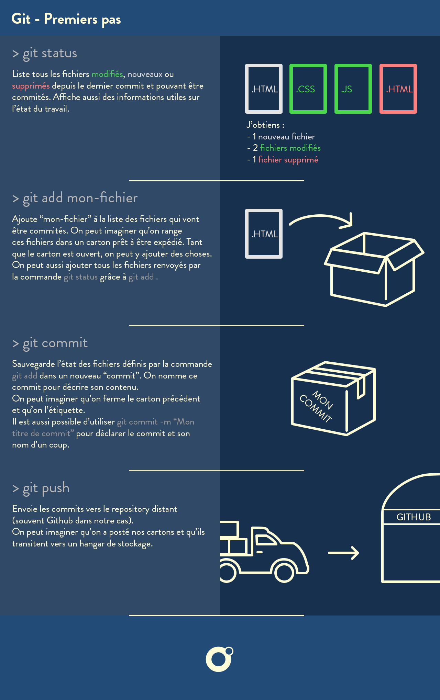

# Commandes Git

- [Cheat Sheet Git](assets/pdf/Github_Git_Cheat_Sheet.pdf)
- [GitFlow, méthode de travail très efficace pour gérer les branches](https://www.atlassian.com/fr/git/tutorials/comparing-workflows/gitflow-workflow)

## Obtenir la version de git

```sh

# Renvoie la version installée de git
git --version
git version 2.35.1

```

## Obtenir de l'aide

```sh

# Renvoie la liste des commandes disponibles
git --help

# Idem pour une commande précise 
git [commande] -h

```

## Configuration des outils

Cela va permettre de configurer les informations de l'utilisateur pour tous les dépôts locaux.

```sh

# Nom affiché dans les commits
git config --global user.name "John Wick"

```

```sh

# Email associé au commit (conseil: le même que celui du compte GitHub):
git config --global user.email "john.wick@lecroquemitaine.fr"

```

```sh

# Choix de l'éditeur de texte utilisé pour écrire les messages de commit:
git config --global core.editor nano # ou code pour Visual Studio Code, etc.

```

```sh

# Utilisation de 'master' comme nom de la branche initiale.
# Pour configurer le nom de la branche initiale pour tous les nouveaux dépôts.
# 'master' -> 'main', 'trunk' & 'development'.
git config --global init.defaultBranch <nom>

# La branche nouvellement créée peut être rénommée avec:
git branch -m <nom>

```

```sh

# Activation des couleurs dans le résultat des commandes git
git config --global color.ui true

```

⚠️ **WARNING**

> Pour vérifier la configutation complète: `git config -l`. Cette commande va afficher tous les réglages actifs de `git`.

## Créer des dépots

```sh

# Crée un dépôt local à partir du nom spécifié
git init [nom-du-projet]

```

```sh

# Télécharge un projet et tout son historique de versions (par défaut : nom du repo sur le remote)
git clone [url] [nom-du-projet]

```

## Pour les premiers commits

<p align="center">
  
</p>

## Vérifier l'état courant du repo local

```sh

# Récapitule l'état local (workspace et index) des fichiers du projet géré avec git
git status

```


- **En rouge:** modifié mais non pris en compte (= en workspace)
- **En vert:** modifié et pris en compte (= ajouté à l'index)
