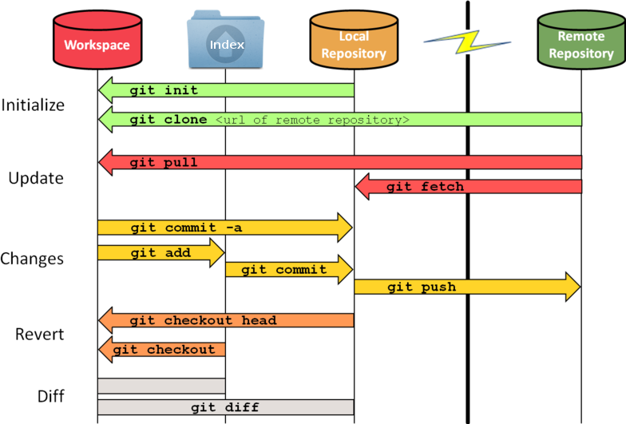

# Git (Versionning & Collaboration)

  

[Git](https://git-scm.com/) est un outil collaboratif de [gestion de version](https://fr.wikipedia.org/wiki/Gestion_de_versions), créé par Linus Torvalds. C'est un outil simple et performant, dont la principale tâche est de gérer l'évolution du contenu d'une arborescence (donc d'un site internet).

## Concepts fondamentaux de git

Pour un dossier de travail donné, Git manipule différents **espaces virtuels**:

| Espaces                               | Description                                                                                    |
| :------------------------------------ | :--------------------------------------------------------------------------------------------- | 
| `Workspace`                           | Espace stockant les modifications en cours (pas encore prises en compte par git) |
| `Index (ou Stage)`                    | Espace stockant les modifications en cours (qui seront prises en compte par git pour le prochain commit) |
| `Local Repository`                    | Espace stockant les modifications (déjà prises en compte par git) |
| `Remote Repository`                   | Désigne le dépôt distant (remote, sur [GitHub](https://github.com/) par exemple) |

 

  

