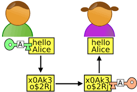

# Créer une clé SSH pour GitHub

Avant toute chose, pour utiliser [Git](https://git-scm.com/) et [GitHub](https://github.com/) à leur pleins potentiels, on va créer une clé dite SSH. Cette clé est une carte d'identité nous permettant de nous authentifier auprès de [GitHub](https://github.com/), notamment pour accéder aux repos privés, signer nos commits, etc.

- [Connecting to GitHub with SSH](https://help.github.com/articles/connecting-to-github-with-ssh/) 

## Vérification des clés existantes

Avant de générer une clé SSH, on peut vérifier si nous n'avons pas déjà de clés existantes.

```sh

# Affiche les fichiers du répertoire .ssh, s'ils existent
$ ls -al ~/.ssh

```

Par défaut, les noms de fichier des clès publiques supportées pour GitHub sont les suivantes: 
- `id_rsa.pub`
- `id_ecdsa.pub`
- `id_ed25519.pub`

## Création de la clé

```sh

# Attention à bien remplacer l'email par le votre ;)
$ ssh-keygen -t ed25519 -C "your_email@exemple.fr"

```

⚠️ **WARNING**

> Si votre système ne supporte pas Algorithme Ed25519, il faudra utiliser ce code:

```sh

# Attention à bien remplacer l'email par le votre ;)
$ ssh-keygen -t rsa -b 4096 -C "votre-email@exemple.fr"

```

> Il vous sera demandé d'inventer **une passphrase**, c'est-à-dire un mot de passe un peu costaud (qui peut carrément être une phrase, avec des espaces, des accents et tout ! Cette passphrase n'est pas strictement obligatoire (elle peut être vide…), mais il est fortement recommandé d'en choisir une. Par contre, il faut la retenir par cœur, si elle est perdue, **la clé SSH est bonne à jeter !**

Une clé SSH se compose de **deux parties**, si bien qu'à l'issue de la commande, vous obtenez deux choses:

- une **clé privée** dans `/home/mint/.ssh/id_rsa` — pour protégér du contenu, à garder pour soi !
- une **clé publique** dans `/home/mint/.ssh/id_rsa.pub` — elle est capable de lire du contenu protégé par la clé privé

<p align="center">
  
</p>

## Ajout de la clé publique sur GitHub

Vous allez donc copier le contenu de la clé publique sur [GitHub](https://github.com/). Vous pouvez regarder le contenu de la clé publique, par curiosité:

```sh

# Pour récupérer le contenu de notre clé publique
cat ~/.ssh/id_rsa.pub

```

Copiez ce contenu, et allez le coller dans votre compte [GitHub](https://github.com/):

```sh

Settings > SSH and GPG keys > New SSH key > Coller le contenu de la clé et valider

```

⚠️ **WARNING**

> Pour que Git utilise automatiquement **la clé SSH** pour authentifier les commandes git ..., il faut utiliser des URLs avec le protocole `SSH` plutôt que `HTTPS`. [Why is GIT always asking for my password?](https://help.github.com/articles/why-is-git-always-asking-for-my-password/)

## Activation de la clé SSH en local

Pour que la clé SSH soit utilisable, et aussi pour éviter d'avoir à donner sa passphrase à chaque utilisation, il faut ajouter la clé privée à un « trousseau de clé » (programme `ssh-agent`):

```sh

eval "$(ssh-agent -s)" # pour lancer ssh-agent de façon sécurisée
ssh-add ~/.ssh/id_rsa # pour activer la clé SSH

```

⚠️ **WARNING**

> Si vous oubliez cette étape, vous aurez des erreurs du type "Permission denied (publickey)" lors de l'utilisation de Git & GitHub.
