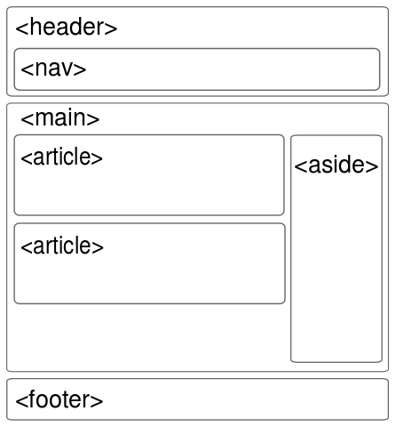

# Les balises de stucture

  

| Balise      | Fonction                                         |
| :---------- | :----------------------------------------------- |
| `<header>`  |                                                  |
| `<nav>`     |                                                  |
| `<main>`    |                                                  |
| `<section>` |                                                  |
| `<article>` |                                                  |
| `<aside>`   |                                                  |
| `<footer>`  |                                                  |
