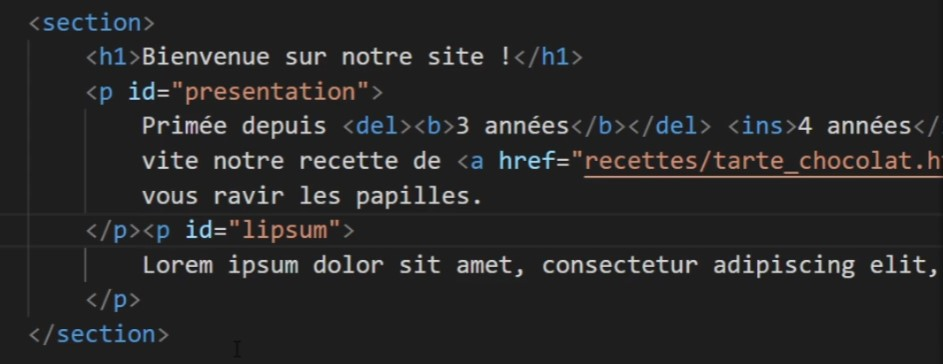

# Element de type `display`

## Block [MDN](https://developer.mozilla.org/fr/docs/Web/HTML/Block-level_elements)

Un élément de type bloc occupe tout l'espace horizontal de son élément parent (conteneur), et un espace vertical égal à la hauteur de son contenu, créant ainsi un bloc.

## Inline [MDN](https://developer.mozilla.org/fr/docs/Web/HTML/Inline_elements)

Les éléments en lignes n'occupent que l'espace entre leurs balises et s'insèrent dans le flux du contenu plutôt que de créer un nouveau « bloc » visuel.

## Inline-Block

Des éléments qui se mettent les uns à côté des autres et qui sont redimensionnables.

### ⚠️ WARNING
> A chaque `inline-block` que l'on utilise, il y a un petit espace blanc (environ 4px) qui se créee. le seul moyen c'est de mettre les balises côte à cote (aucun trou).

  

