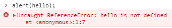

# Exceptions

<p align="center">
  
</p>

## Try & Catch

```js

try {
    alert(hello);
} catch (error) {
    alert(`la variable Hello n'existe pas`); 
}

```

```js

// alert(error.name); // ReferenceError
// alert(error.message); // hello is not defined
// alert(error); // ReferenceError: hello is not defined
// alert(error.stack); // ReferenceError: hello is not defined at test.js:2:11
// console.error(error.stack); ReferenceError: hello is not defined at test.js:2:11 (en ROUGE dans la console)

```

## Throw New Error

```js

try {
    let recompense = prompt("Choisissez une récompense : épée, arc, haches");
    let degats;
    
    switch(recompense) {
      case 'épée':
        degats = 40;
        break;
      case 'arc':
        degats = 30;
        break;
      case'haches':
        degats = 20;
        break;
      default:
        throw new Error('Vous ne pouvez pas tricher.');
    }
    
    alert(`Vous avez choisi: ${recompense} -> ${degats} dégats`);

} catch(error) {
    alert(error);
} finally {
    alert('Fin du programme'); // s'éxécute à chaque fois
}


```
