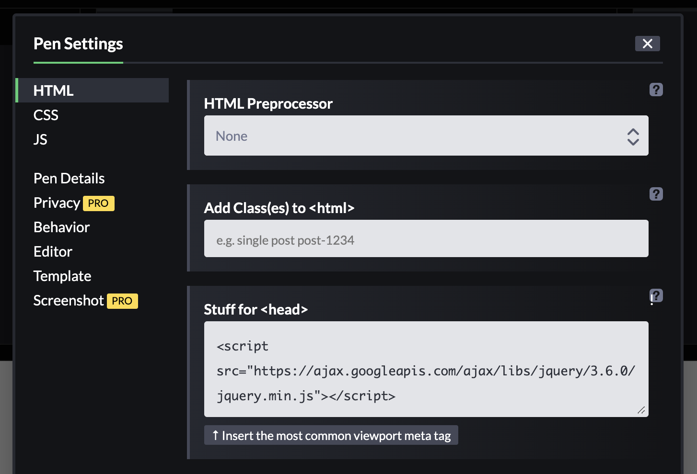
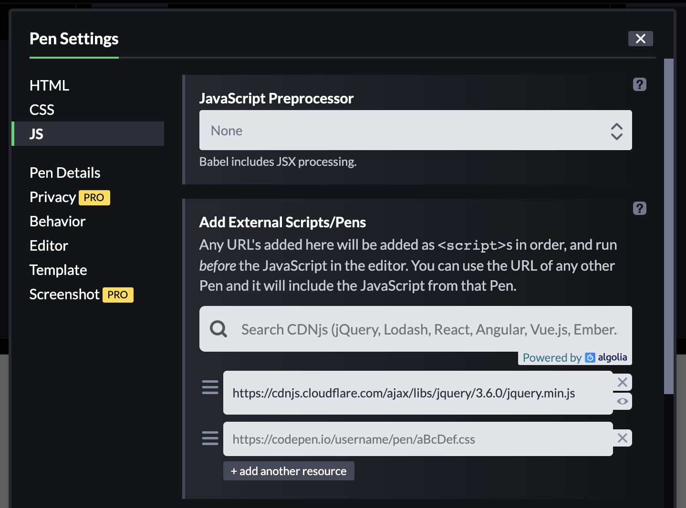

# jQuery [V3.6.0](https://jquery.com/download/)

Il existe une 2 types de versions:
- [compressed](https://code.jquery.com/jquery-3.6.0.min.js) -> code minifié, tout le code est à la suite sans saut de ligne.
- [uncompressed](https://code.jquery.com/jquery-3.6.0.js)

## Install

On peut installer jQuery de différentes manières:

### Npm

```sh

npm install jquery

```

### Yarn

```sh

yarn add jquery

```

### Bower

```sh

bower install jquery # uncompressed release

```

```sh

bower install https://code.jquery.com/jquery-3.6.0.min.js # compressed release

```

### CDN [Documentation](https://jquery.com/download/#using-jquery-with-a-cdn)

```html

<script src="https://ajax.googleapis.com/ajax/libs/jquery/3.6.0/jquery.min.js"></script> // Google CDN

```

### CodePen

**Methode 1:** On va dans la catégorie (engrenage) `HTML` et on ajoute une balise `script` dans le `head`.

<p align="center">
  
</p>

**Methode 2:** On va dans la catégorie (engrenage) `JavaScript` et on cherche le bon CDN.

<p align="center">
  
</p>

## Utilisation

```html

<h1 class="title">Bienvenue</h1>
<p id="monId">Ceci est un div</p>
<p class="maClass">Ceci est un div également</p>

```

### Sélectionner un élément

```js

// Avec JavaScript
document.querySelector('h1');
document.querySelectorAll('p');

// Avec jQuery
$('h1'); // on donne le sélecteur CSS
$('p'); // on sélectionne tous les paragraphes

```

### Modifier un élément

```js

// Avec JavaScript
document.querySelector('h1').textContent = 'Bonjour avec JavaScript';
// document.querySelectorAll('p').textContent = 'Ceci est un paragraphe'; impossible
document.querySelector('.maClass').innerHTML = '<p><b>HTML modifié</b></p>';

// Avec jQuery
$('h1').text('Bonjour avec jQuery');
// $('p').text('Ceci est un paragraphe');
$('.maClass').html('<p><b>HTML modifié avec jQuery</b></p>');

```

⚠️ **WARNING**
> Ne pas mettre avec jQuery de `=` après la propriété `text` comme en JavaScript. Il faut mettre le contenu entre les parenthèses avec des guillemets.

> Il n'est pas possible en JavaScript de mofidier le contenu de tous les paragraphes (sauf si on utilise une boucle). Avec JQuery, c'est possible.

### Modifier le style d'un élément

```js

// Avec JavaScript
document.querySelector('h1').style.color = 'orange';
document.querySelector('h1').style.color; // renvoie la valeur de color
document.querySelector('#monId').className = 'important';
document.querySelector('#monId').className = ''; // impossible d'enlever une seule class, on est obligé de tout enlever
document.querySelectorAll('p').style.color = 'green'; // ne fonctionne pas

// Avec jQuery
$('h1').css('color', 'orange');
$('h1').css('color'); // renvoie la valeur de color
$('#monId').addClass('important'); // ajoute une classe
$('#monId').removeClass('important'); // supprime une classe
$('p').css('color', 'green');

```

