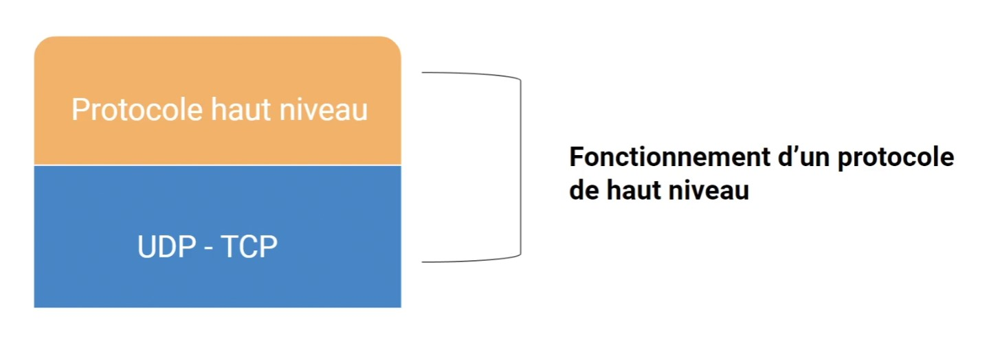

# Les Protocoles

## Les protocoles de bas niveau

| Protocole | Définition                     | Commentaire                                                           |
| :-------- | :----------------------------- | :-------------------------------------------------------------------- |
| `TCP`     | Transmission Control Protocol  | 100% des paquets vont arriver                                         |
| `UDP`     | User Datagram Protocol         | Peut perdre des données / très rapide, notamment pour les jeux vidéos |

## Les protocoles de haut niveau

  

| Protocole | Définition                                       |
| :-------- | :----------------------------------------------- |
| `HTTP`    | Pour accéder à une page web                      |
| `HTTPS`   | Pour accéder à une page web de manière sécurisée |
| `FTP`     | Pour échanger des fichiers                       |
| `SMTP`    | Pour envoyer des emails                          |
