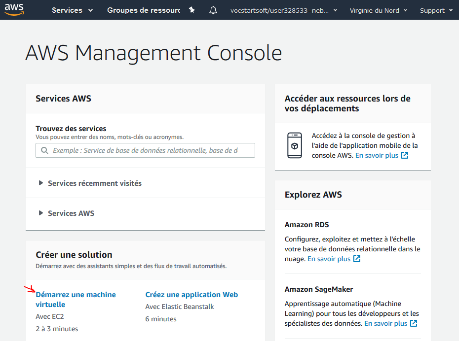

# Créer une instance EC2 sur AWS

Se connecter à la console AWS.  
Pour rappel, la fiche récap [create_account](create_account.md) permet de savoir comment accéder à la console AWS.

## Accéder à l'assistant de création d'instance EC2

<details>



</details>

## Système d'exploitation

C'est le moment de choisir l'OS de notre serveur.

Pour rester proche de la VM sous Linux Mint, on va sélectionner **la dernière version d'Ubuntu LTS**.  
=> **Attention bien vérifier la sélection d'Ubuntu.**

<details>


</details>

## Ressources

On va commencer sobrement et on va créer une instance "gratuite" EC2 : `t2.micro`.  
Ainsi, on ne consommera pas nos crédits.

<details>


</details>

## Configuration

Rien à faire au niveau de cette étape.  
"Suivant" !

<details>


</details>

## Stockage

Rien à faire au niveau de cette étape.  
On peut laisser les 8 Go par défaut.  
"Suivant" !

<details>


</details>

## Balises

Rien à faire au niveau de cette étape.  
"Suivant" !

<details>


</details>

## Groupe de sécurité

Par défaut, tous les ports du serveur sont fermés.  
Sauf qu'on veut que nos visiteurs puissent accéder à notre site internet.  
Donc on va ouvrir les ports correspondants à notre Serveur Web : `80` (http) et `443` (https)

Et comme on veut aussi accéder au serveur grâce à une connexion SSH (en ligne de commande),  
Et bien on doit aussi ouvrir le port correspondant : `22`

Pour prévenir un peu nos usages futurs (#apothéose :wink:), on va aussi ouvrir le port pour MySQL `3306` en ajoutant une règle avec pour type `MYSQL/AURORA` et pour source `n'importe où`.

**Attention**, les descriptions ne doivent pas comporter d'accents ou caractères spéciaux !

<details>


</details>

## Résumé de l'instance

Vérifier les paramètres et "Lancer" !

<details>


</details>

## Clé de sécurité

:warning: **cette étape est très importante !**  
Pour se connecter aux serveurs AWS en SSH, on a besoin d'un clé de sécurité : un fichier `.pem`

### Option 1 : créer une nouvelle paire de clés

Vous devez nommer votre clé (le fichier qui sera téléchargé) : **ne pas mettre de caractères spéciaux !**

Si tu as déjà créé un fichier `.pem` alors tu peux sélectionner "Choisir une paire de clé existante".  
Sinon, il faudra crée une nouvelle clé, la télécharger et **NE PAS PERDRE CE FICHIER** !

<details>


</details>

### Option 2 : importer une paire de clés existantes
Il va falloir copier/coller votre clé SSH, sur votre téléporteur tapez la commande suivante et copiez collez, le résultat :

`cat ~/.ssh/id_rsa.pub`
La sortie doit ressembler à quelque chose comme ça :
```
ssh-rsa AAAAB3NzaC1yc2EAAAADAQABAAACAQC/4utcvHCTHR6dreX/SlaDuGGIU1PmxTK+AteZPnAF1h3aAsdpKmb3sO4Z1tbIxHgl0cjABS/ex28/nrKbu64SBf6HbaHnA7blPpVjySvMSKhQpXOeOL55/pUorhSlLMQy3mI6iTEEvOG034HLxnD1PhThRF7d6+RVd5KmQFORwqhQOdH7GEpiiqQIWckdyth1Ka9J0ATW9DPPYJJ3q73GJSAxnt1597i/P07Dj0yOItmIf5BPxPLKI7uC9d/4AGbvUgMDuZmxIWOvqr1j2TJomXWdsaaCb/1QAAGPbqld2Lxrgksqqt66l0UOaQXiY1SB0qhRk5W5r/O8xtPf84GM46aOn9A7fGapN3bS7IIkbFW3vac4lR1cKl6OtX4THbhARdVYjfelnkTVFkmHqDq4dHyRXPo3/NWEIPgSoPb2ZVP5Ln/qhV4dbt2uOjCVCsWMIXZF4oz3r5Wn9TPQQuYpyxYeTOBzqu4aBHjfnSVuN2Li8yCixsKPnLH9rugbf1Wt+tGEI7Ry0nm83XUUevo1m4ZafzexV69DDLh2CDiMKGr+xDh/pOvyYa7lbeiEJcZCczmgOo82nEoq2AHqelJd9OR6jUWlPXexiTC9nCjcko0QBFJ/2azKlKXv8W7Ijcgrq2hBMJEO9+ICXSRyq9dkDFsfJeXUJsKagaG/zdRkFQ== profy@nuc
```
Votre clé doit commencer par ssh-rsa ou ssh-dsa, c'est votre clé publique SSH, que vous pouvez partager avec tout le monde pour qu'on vous donne accès à des ressources, vous l'avez déjà renseignée dans Github et maintenant c'est le tour d'AWS.

Copiez tout le bloc de votre clé (ssh-rsa y compris).

De retour dans la console EC2 (EC2 > Key pairs), cliquez sur Import key pair, mettez votre nom et collez le contenu de votre clé.

## Lancement !

Puis on lance l'instance :tada:

<details>


</details>

## Confirmation de création

AWS nous résume l'instance qui vient d'être créée.

<details>


</details>

## Liste des instances

Dans la console AWS, on peut visualiser toutes les instances qui ont été créées, qu'elles soient actives ou non.  
Le nom de domaine attribué par AWS à l'instance est visible en bas "DNS public".

<details>


</details>
