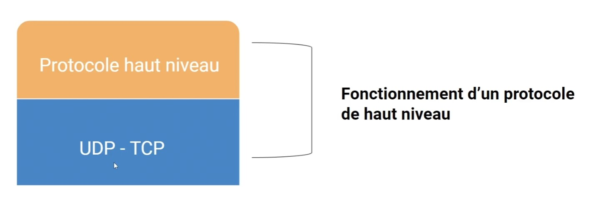

# Les Protocoles

## Les protocoles de bas niveau
- **TCP** (Transmission Control Protocol)
- **UDP** (User Datagram Protocol) -> peut perdre des données / très rapide, notamment pour les jeux vidéos

## Les protocoles de haut niveau

- **HTTP** -> Pour accéder à une page web
- **HTTPS** -> Pour accéder à une page web de manière sécurisée
- **FTP** -> Pour échanger des fichiers
- **SMTP** -> Pour envoyer des emails
