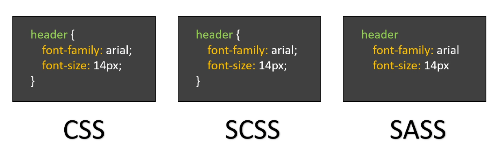
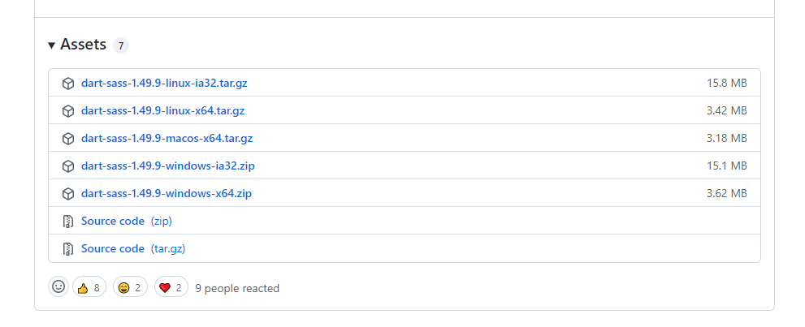
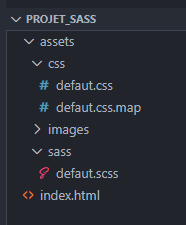
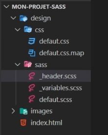

# SASS (Syntactically Awesome Style Sheets)

## Introduction

 - [SASS Basics](https://sass-lang.com/guide)

<p align="center">
  
</p>

## Installation

### Téléchargement
- [Releases](https://github.com/sass/dart-sass/releases/)

<p align="center">
  
</p>

Il suffit de télécharger le bon fichier en fonction de son OS et de glisser `dart-sass` par exemple dans `C:\Program Files`.

### Ajouter SASS à nos variables d'environnement [Documentation](https://katiek2.github.io/path-doc/)

1. Versions de Windows
   * Pour Windows 8 ou 10 -> Appuyer sur la touche `Windows` et chercher `Système (Panneau de configuration)`.
   * Pour Windows 7 -> Click droit sur icone ordinateur sur le bureau et cliquer sur propriétés.
2. Paramètres avancés du système
3. Variables d'environnement ...
4. En dessous de Variables système, trouver la variable `PATH` et cliquer sur Modifier. Sinon il faudra la créer en appuyant sur Nouvelle.
5. Ajouter votre répertoire en appuyant sur Nouveau.
6. Appuyer sur OK
7. Redémarrer le Terminal
8. Pour vérifier si tout est ok, il faut taper `sass --version`

## Utilisation

<p align="center">
  
</p>


```sh

# 1ere façon
sass assets/sass/defaut.scss assets/css/defaut.css

# 2e façon
sass --watch assets/sass/defaut.scss assets/css/defaut.css

# 3e façon (meilleure méthode)
sass --watch assets/sass:assets/css/

# 4e façon (meilleure méthode + argument pour mettre notre fichier css sur une ligne)
# --style -> -s (par défaut, expanded)
sass --watch assets/sass:assets/css/ -s compressed

```

## Variables

```css

$couleurPrincipale: orange;

body {
    background-color: white;
    color: $couleurPrincipale;
}

```

## Commentaires

```css

// Commentaire monoligne

/*
    Commentaire
    sur plusieurs lignes
    différentes
*/

```

## Opérations Mathématiques

```css

/*
    Opérateurs :
        + : addition
        - : soustraction
        * : multiplication
        / : division
        % : modulo (restant d'une division)
*/

html {
    font-size: 15px * 2;
}

```

## Imbrications

```css

header {
    background-color: $couleurPrincipale;
    color: white;
    padding: 15px;
    text-align: center;
    margin-bottom: 10px;

    ul {
        margin: 0; padding: 0;
        list-style: none;

        li {
            display: inline-block;
        }
    }

    nav {
        a {
            text-decoration: none;
        }
    }
}

// Imbrication des propriétés (nesting)
// N'oubliez pas les ":" :)

p {
  font: {
    family: arial;
    weight: bold;
    size: 2em;
  }
}

```

## Rôle Opérateur &

```css

nav {
    a {
        text-decoration: none;

        &:hover {
            color: red;
        }
    }
}

```

## Importation + Partials

```css

/* A mettre dans defaut.scss */ 
@use 'header';

```

⚠️ **WARNING**
> Pour ne pas générer la feuille de style `header.css` dans le dossier `assets/css`, on va utiliser les partials (feuilles de styles dédiées à être intégrées dans d'autres feuilles de style). On va ajouter un underscore devant le nom du fichier: `_header.scss`.

<p align="center">
  
</p>

## Regrouper toutes les variables

On va mettre toutes variables dans un partial `_variables.scss`

```css

/* A mettre dans defaut.scss */ 
@use 'header';

@import 'variables';

```

⚠️ **WARNING**
> Il faut d'abord utiliser `@use` avant d'utiliser `@import`.

## Héritage

On va faire hériter la classe `.message` à  `.succes` & `.erreur`

```css

/* message */ 
.message {
    color: white;
    border-radius: 10px;
    padding: 10px;
    margin: 5px;
}

/* succés */ 
.succes {
    @extend .message;
    background-color: green;
}

/* erreur */ 
.erreur {
    @extend .message;
    background-color: red;
}

```

## Mixins

On va pouvoir par exemple en plus de l'héritage, jouer sur un paramètre. Ex `$couleur`

```css

/* MIXINS */ 
@mixin message($couleur: white) {
    color: $couleur;
    border-radius: 10px;
    padding: 10px;
    margin: 5px;
}

/* succés */ 
.succes {
    @include message();
    background-color: green;
}

/* erreur */ 
.erreur {
    @include message();
    background-color: red;
}

/* notification */ 
.erreur {
    @include message(black);
    background-color: #f3f3f3;
}

```

⚠️ **WARNING**
> On peut utiliser les mixins pour afficher les valeurs pour les anciens navigateurs. Si on veut imbriquer des mixins dans des mixins, il faut faire attention à l'ordre. (ex: border-radius avant message).

```css

/* MIXINS */ 
@mixin border-radius($radius...) { /* Spread operator -> arguments variables */  
    -webkit-border-radius: $radius;
    -moz-border-radius: $radius;
    -ms-border-radius: $radius;
    border-radius: $radiusA $radius;
}

@mixin message($couleur: white) {
    color: $couleur;
    @include border-radius(5px 10px 5px 10px);
    padding: 10px;
    margin: 5px;
}

/* succés */ 
.succes {
    @include message();
    background-color: green;
}

/* erreur */ 
.erreur {
    @include message();
    background-color: red;
}

/* notification */ 
.erreur {
    @include message(black);
    background-color: #f3f3f3;
}

```

⚠️ **WARNING**
> On peut utiliser les mixins pour utiliser au mieux [Google Fonts](https://fonts.google.com/).

```css

/* MIXINS */
@mixin googleFonts($nom) {  
    @import url('https://fonts.googleapis.com/css2?family=' + $nom + '&display=swap');
}

/* @import url('https://fonts.googleapis.com/css2?family=Roboto:wght@300;400;700&display=swap'); */
@include googleFonts('Roboto:wght@300;400;700');
@include googleFonts('Poppins');
@include googleFonts('Open+Sans');

html {
    font-size: 16px;
    font-family: 'Open Sans', 'Poppins';
    font-weight: 700;
}

```

## Fonctions

### Fonctions Natives

- lighten (éclaircir une couleur)
- darken (assombrir une couleur)
- round (arrondir une valeur)

```css

header {
    background-color: lighten($couleurPrincipale, 15%);
}

/* background-color: darken($couleurPrincipale, 15%); */
/* padding: round(15px / 2); */

```

### Nos Propres Fonctions

```css

/* FONCTIONS */

@function foisQuatre($nombre) {  
    @return $nombre * 4;
}

html {
    font-size: foisQuatre(4px);
    font-family: 'Open Sans', 'Poppins';
}

```

## Conditions & Boucles

### Conditions

```css

body {
    margin: 0;
    height: calc(100vh - 16px);
    
    @if ($theme == 'violet') {
        color: purple;
        background-color: white;
    } @else if ($theme == 'noir') {
        color: white;
        background-color: black;
    } @else {
       color: black;
       background-color: white;
}

```

### Boucles @for

```css

@for $i from 1 through 20 {

    .colonne-#{$i} {
        width: 50px*$i;
    }

}

```

```css

@for $font-size from 12 through 18 {

    @if ($font-size%2 == 0) {

        .font-size-#{$font-size} {
            font-size: $font-size * 1px;
        }

    }

}

```

### Boucles @each

```css

@each $nom in mark, bill, steve {

    .avatar-#{$nom} {
        background-image: url('../../images/avatars/#{$nom}.png') no-repeat;
    }

}

```

### Boucles @while

```css

/* Création variable i */
$i: 1;

@while ($i <= 6) {

    .colonne-#{$i} {
        width: 50px*$i;
    }

    $i: $i + 1;

}

```

```css

$font-size: 12;

@while ($font-size <= 18 ) {

    .font-size-#{$font-size} {
        font-size: $font-size * 1px;
    }

    $font-size: $font-size + 2;

}

```

## Astuces

### Listes

```css

$noms: "mark", "bill", "steve", "anna";

@each $nom in $noms {

    .avatar-#{$nom} {
        background-image: url('../../images/avatars/#{$nom}.png') no-repeat;
    }

}

```

⚠️ **WARNING**
> A la différence des `tableaux`, `les listes`, on un index qui commence à 1.

### Fonction nth()

```css

$noms: "mark", "bill", "steve", "anna";
$nombreActuel: 1;

@each $nom in $noms {

    .avatar-#{$nom} {
        background-image: url('../../images/avatars/#{$nom}.png') no-repeat;
        content: nth($noms, $nombreActuel);
    }
    
    $nombreActuel: $nombreActuel + 1;
}

```

### Ajouter Valeurs Liste Dynamiquement

```css

$noms: "mark", "bill", "steve", "anna";
$nombreActuel: 1;

$noms: append($noms, "dora", comma); /* space comma auto */
/* space -> "anna dora" */
/* comma -> "anna", "dora" */
/* auto -> analyse déjà la forme de la liste */

@each $nom in $noms {

    .avatar-#{$nom} {
        background-image: url('../../images/avatars/#{$nom}.png') no-repeat;
        content: nth($noms, $nombreActuel);
    }
    
    $nombreActuel: $nombreActuel + 1;
}

```

### @at-root

```css

header {
    background-color: $couleurPrincipale;
    color: white;
    padding: 15px;
    text-align: center;
    margin-bottom: 10px;

    ul {
        margin: 0; padding: 0;
        list-style: none;

        li {
            display: inline-block;
        }
    }

    @at-root {
        nav {
            a {
                text-decoration: none;
            }
        }
    }
}

```

### Maps

```css

/* VARIABLES */
$font-weights: ('regular': 400, 'medium': 500, 'bold': 700);
$font-lights: ('lightest': 100, 'light': 300);

$font-weights: map-merge($font-weights, $font-lights);

```

```css

/* font-weight: map-get($font-weights, 'bold'); */
font-weight: map-get($font-weights, 'lightest');

```


