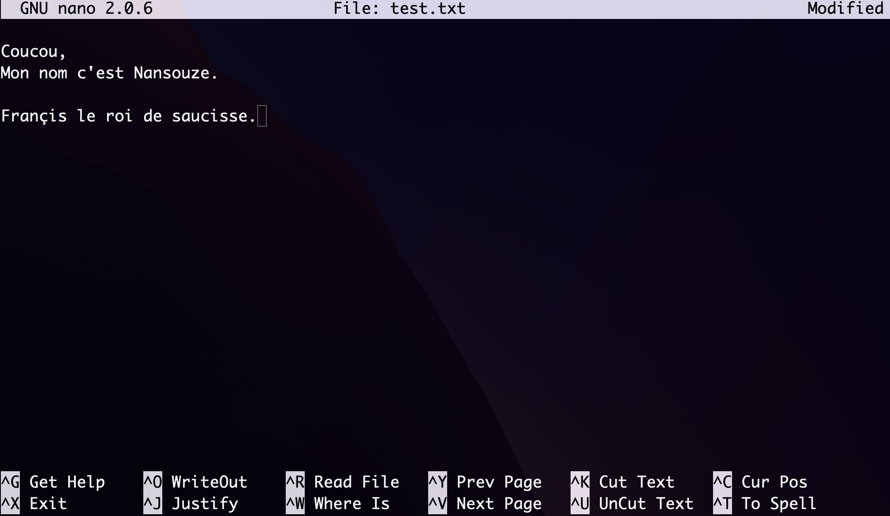

# Terminal

C'est l'interface graphique qui va vous permettre d'accèder au **SHELL**. (`Bash`, `Zsh` ...).

| OS          | Shell             |
| :---------- | :---------------- |
| `Linux`     | `Bash`, `Zsh` ... |
| `macOs`     | Jusqu'aux dernières version, le shell par défaut qui était utilisé, c'était `Bash`. <br> A partir de macOS Catalina, c'est maintenant `Zsh`. |
| `Windows`   | Vous n'avez ni `Bash`, ni `Zsh`. A la place, on a l'invite de commande (`cmd.exe`). <br> Celà nous permet d'éxécuter des commandes `DOS` et d'ouvrir un autre shell qui est `Powershell` mais avec des commandes complètement différentes de `Bash` & `Zsh`. |

## Avant de commencer

### Casse
Le **shell script** (ou le langage que vous utilisez dans le terminal) est un langage qui est sensible à la casse. C'est à dire que les majuscules et les minuscules sont considérés comme des caractères différents.

Par exemple `pwd` est une commande, alors que `PWD ou Pwd ou pWD...` n'est pas une commande (n'existe pas).

### Tilde `~`
Dans le terminal, la tilde représente le répertoire HOME de l'utilisateur (vous). Ce répertoire est celui dans lequel vous trouvez (la plupart du temps) les dossiers suivants  :

```sh

~ ls
Applications         Library                  
Desktop              Movies             
Documents            Music
Downloads            Pictures

```

### Autocompletion
Très utile. Les développeurs sont des flemmards, c'est pour ça qu'ils ont mis en place l'autocomplétion.
Le principe est d’appuyer sur la touche `tabulation` pendant la saisie, et l'ordinateur va compléter tout seul votre saisie **si il peut**.


## Commandes basiques

Elles vont nous permettre de naviguer dans nos fichiers à l'aide du terminal.

### `man` - Manual (affiche la documentation)

```sh

~ man ls

```

⚠️ **WARNING**

> Pour se déplacer dans la documentation on utilise la `barre d'espace. Pour sortir de la doc, on utilise la touche `q`.

<p align="center">
  
</p>

### `pwd` - Print Working Directory (affiche le dossier dans lequel on se trouve actuellement)

```sh

~ pwd
/Users/fsb

```

⚠️ **WARNING**

> Petite astuce, dans un terminal si on surligne un block de texte et qu'on appuie sur la molette de la souris, on va automatiquement coller ce que nous avions sélectionné.

<p align="center">
  
</p>

### `ls` - Lister le contenu d'un répertoire

```sh

~ ls
Applications         Library                  
Desktop              Movies             
Documents            Music
Downloads            Pictures

```

⚠️ **WARNING**

> Par convention, les fichiers/dossiers qui commencent par . sont cachés. Pour les voir, il faut utiliser `ls -a`. (a -> pour all)

> Il est possible d'ajouter une mise en liste avec l'option `-l` (l -> pour long) soit : `ls -l` (permissions, propriétaire, date ...)

> On peut combiner les deux arguments `ls -la`

> Pour savoir si c'est un dossier, on voit au début `d`(directory). Si il y a un `-`, celà veut dire que c'est un fichier.

<p align="center">
  
</p>

### `clear` - Nettoyage du terminal

```sh

~ clear

```

### `reset` - Relance le terminal

```sh

~ reset

```

### `cd` - Change Directory

```sh

~ cd Pictures
~ cd ..
~ cd ../Music

```

## Jouer avec les fichiers & les dossiers

### `touch` - Créer un nouveau fichier

```sh

~ touch python.txt
~ touch Documents/readme.txt

```

### `cat` - Afficher le contenu du fichier

```sh

~ cat test.txt
Coucou,
Je suis Nansouze.
François le roi de saucisse.

```

⚠️ **WARNING**

> On peut aussi utiliser `head` (5 premières lignes) & `tail` (5 dernières lignes).

### `nano` - Editer un fichier

```sh

~ nano test.txt

```

⚠️ **WARNING**

> Le symbole `^` c'est pour `ctrl`. <br>Ex: `ctrl + O` (sauvegarder) & `ctrl + X` (exit)

<p align="center">
  
</p>

### `mkdir` - Make Directory

```sh

~ mkdir Python
~ mkdir Documents/Python

```

### `open` - Ouvrir un fichier ou dossier

```sh

~ open . # Point, représente le dossier courant
~ open python.txt

```

### `mv` - Move (déplacer ou renommer)

```sh

~ mv python.txt ./Documents # Déplacer

~ mv README.md readme.md # Renommer

```

### `rm` - Remove (supprimez un fichier ou un dossier plein)

```sh

~ rm readme.md # suppression d'un fichier

```

⚠️ **WARNING**

> Il faut utiliser le flag `-r` (recursive) & `-f` (force) avec **précaution.**

```sh

~ rm -rf test # suppression récursive & forcée d'un dossier

```

<p align="center">
  
</p>

### `rmdir` - Remove Directory (supprimer un dossier vide)

```sh

~ rmdir Postman

```

### `cp` - Copy (copiez vos fichiers ou vos dossiers)

```sh

~ cp chemin/fichier.extension cheminDeDestination/

```

⚠️ **WARNING**

> Pour copier un dossier, on ajoute le paramètre -R (copie récursive).

```sh

~ cp -R chemin/monDossier/ cheminDeDestination/

```

## Bonus

### `say` - Dire (faire parler son terminal)

```sh

~ cp chemin/fichier.extension cheminDeDestination/

```

### `def` - Espace disque

```sh

~ df
Filesystem     512-blocks      Used Available Capacity iused      ifree %iused  Mounted on
/dev/disk1s5s1  976490576  30765480 458828712     7%  577694 2294143560    0%   /
devfs                 405       405         0   100%     714          0  100%   /dev
/dev/disk1s4    976490576   4194344 458828712     1%       2 2294143560    0%   /System/Volumes/VM
/dev/disk1s2    976490576   1197624 458828712     1%    4097 2294143560    0%   /System/Volumes/Preboot
/dev/disk1s6    976490576      6832 458828712     1%      19 2294143560    0%   /System/Volumes/Update
/dev/disk1s1    976490576 479042456 458828712    52% 1317433 2294143560    0%   /System/Volumes/Data
map auto_home           0         0         0   100%       0          0  100%   /System/Volumes/Data/home
map -fstab              0         0         0   100%       0          0  100%   /System/Volumes/Data/Network/Servers

```

``` sh

~ df -h # -h -> Human readable
Filesystem       Size   Used  Avail Capacity iused      ifree %iused  Mounted on
/dev/disk1s5s1  466Gi   15Gi  219Gi     7%  577694 2294121280    0%   /
devfs           203Ki  203Ki    0Bi   100%     714          0  100%   /dev
/dev/disk1s4    466Gi  2.0Gi  219Gi     1%       2 2294121280    0%   /System/Volumes/VM
/dev/disk1s2    466Gi  585Mi  219Gi     1%    4097 2294121280    0%   /System/Volumes/Preboot
/dev/disk1s6    466Gi  3.3Mi  219Gi     1%      19 2294121280    0%   /System/Volumes/Update
/dev/disk1s1    466Gi  228Gi  219Gi    52% 1317470 2294121280    0%   /System/Volumes/Data
map auto_home     0Bi    0Bi    0Bi   100%       0          0  100%   /System/Volumes/Data/home
map -fstab        0Bi    0Bi    0Bi   100%       0          0  100%   /System/Volumes/Data/Network/Servers

```

``` sh

~ Believemy du -h # Affiche la taille du dossier actuel
4,0K    ./Programme Rocket/00_Premier_Site_Internet/recettes
 68K    ./Programme Rocket/00_Premier_Site_Internet/images
 80K    ./Programme Rocket/00_Premier_Site_Internet/sources/polices
 80K    ./Programme Rocket/00_Premier_Site_Internet/sources
168K    ./Programme Rocket/00_Premier_Site_Internet
176K    ./Programme Rocket
184K    .

```


## Régler les droits sur un fichier/dossier

### Permissions / Droits

Pour définir les droits, il faut déjà savoir les compter !

| Type      | Chiffre |
|:----------|:--------|
| Lecture   | 4       |
| Ecriture  | 2       |
| Exécution | 1       |

Et ensuite on fait la somme des chiffres pour déterminer les droits que l'ont souhaite.

Exemples :
- droits en lecture et écriture => `6`
- droits en lecture, écriture et exécution => `7`
- droits en lecture uniquement => `4`

### Utilisateurs

Ensuite, on peut déterminer les permissions pour 3 niveaux/types d'utilisateurs :
- l'utilisateur propriétaire du fichier/dossier
- le groupe d'utilisateurs lié au fichier/dossier
- tous les autres

Ainsi, on peut dire que le propriétaire a tous les droits `7`, le groupe lecture + exécution `5`, aucun droit pour tous les autres `0` => `750`

### La commande

`chmod 755 /var/www/html` :
- lecture+ecriture+execution pour le propriétaire du dossier _/var/www/html_
- lecture+execution pour le groupe du dossier _/var/www/html_
- lecture+execution pour tous les autres

`chmod -Rf 755 /var/www/html` :
- applique la commande précédente pour le dossier _/var/www/html_ mais aussi tous ses enfants
